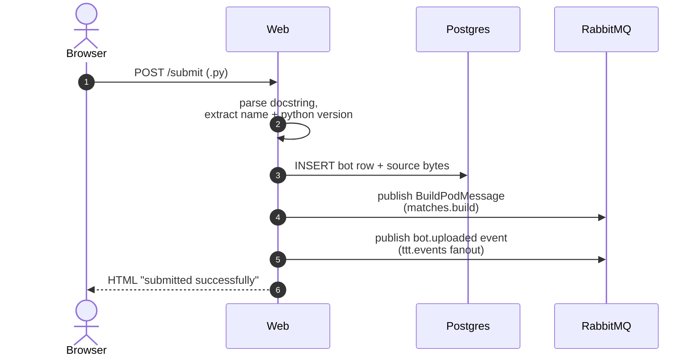
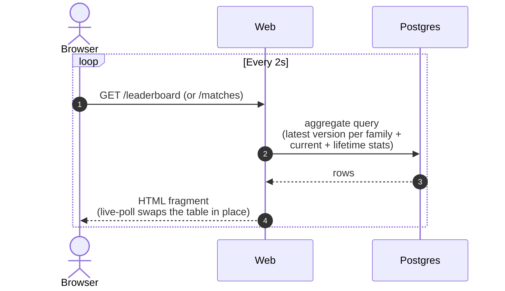
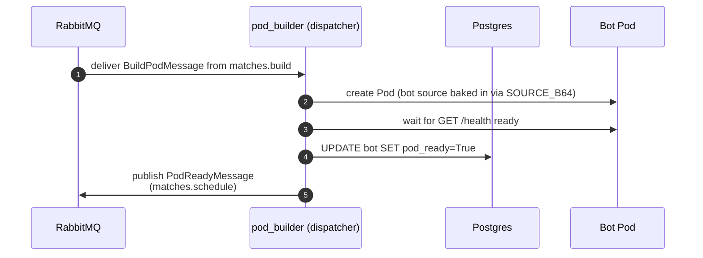
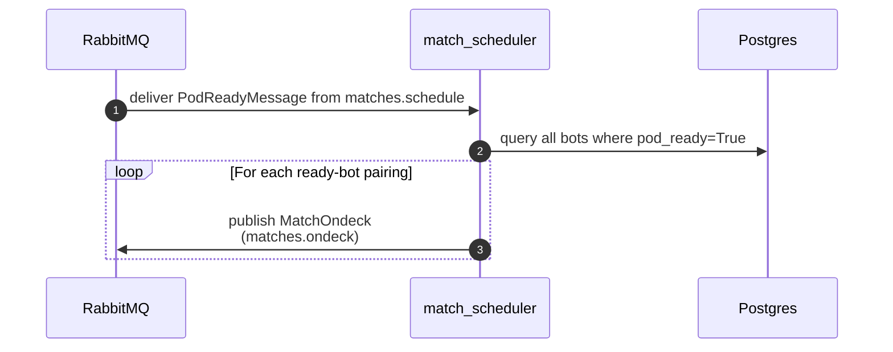
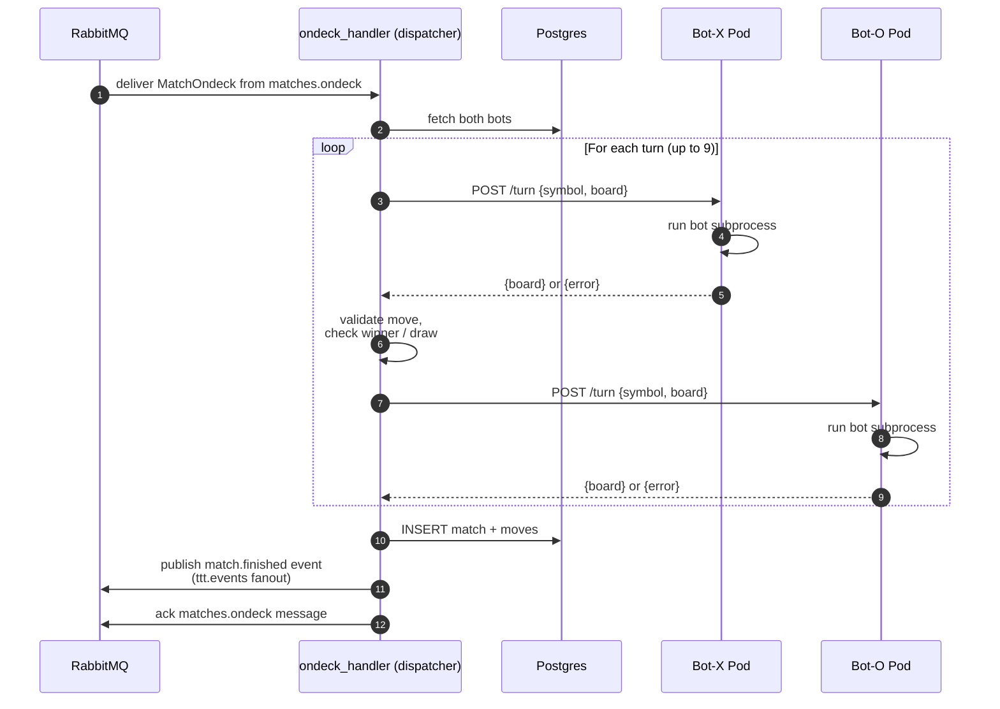
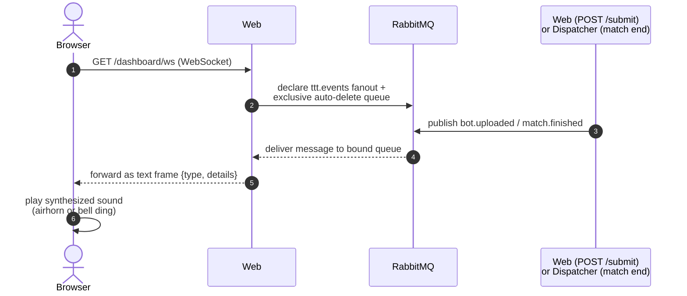

# Pyowa Tic-Tac-Toe Bot Competition

A web platform for the Iowa Python Users Group (Pyowa) bot battle event. Participants submit Python bots that compete in automated tic-tac-toe matches, with results tracked on a live leaderboard.

---

## Building a Bot

A bot is a single `.py` file. The runner invokes it once per move: it gets the current board on stdin and prints the updated board to stdout.

### Required docstring

The very first thing in your file must be a docstring with a `name:` field. Optionally, set `language:` to pin a runtime (defaults to the latest Python 3).

```python
"""
name: My Awesome Bot
language: python-3.13
"""
```

Valid `language:` keys are the entries in the server-side allowlist: **`python-3.10`, `python-3.11`, `python-3.12`, `python-3.13`, `python-3.14`** (and future non-Python runtimes as they are added). Omit the field and you'll get `python-3.14`. The legacy `python: 3.13` form is still accepted as an alias. Anything unrecognised is rejected at upload.

### I/O protocol

**Stdin** — four lines: your symbol, then the 3×3 board (pipe-delimited, `X` / `O` / `.`):

```text
X
X|.|.
.|O|.
.|.|.
```

**Stdout** — the same board with exactly one new piece placed in an empty cell:

```text
X|.|.
.|O|.
.|X|.
```

### Forfeits

Your bot forfeits the match immediately if it:

- Produces no output, or output that isn't a valid 3×3 board
- Places more than one piece, places in an occupied cell, or places the wrong symbol
- Raises an unhandled exception
- Exceeds the per-move time limit

Forfeit wins are tracked separately from clean wins on the leaderboard.

### Example bot

```python
"""
name: Example Bot
"""
import sys

data = sys.stdin.read().strip().splitlines()
symbol = data[0]
board = [row.split('|') for row in data[1:]]

for r in range(3):
    for c in range(3):
        if board[r][c] == '.':
            board[r][c] = symbol
            print('\n'.join('|'.join(row) for row in board))
            sys.exit(0)
```

### Submitting

Open the web UI at `http://localhost:8000` and upload your `.py` file. The first upload of a given name claims it and the site sets a cookie marking you as the owner. Re-uploading the same name (with the cookie) auto-increments the version: `MyBot` → `MyBotV2` → `MyBotV3`. All versions compete independently. Without the cookie, that name is locked to its original owner.

---

## Running the App

### Prerequisites

#### TODO: use nix for this so the only real prereq is nix

- [uv](https://docs.astral.sh/uv/) (Python package manager)
- Python 3.11+
- Docker (builds all app images)
- [kind](https://kind.sigs.k8s.io/) + kubectl (via `nix develop` — runs the full app stack)

### Setup

```bash
git clone <repo>
cd tic-tac-toe-event
uv sync --group dev
```

### Start

The full app runs in Kubernetes (kind). Use the `nix develop` shell — it provides `kind`, `kubectl`, and all other tooling.

```bash
# Build images, create cluster, apply all manifests, wait for readiness, load images
make kind-up
```

Open `http://localhost:8000`. RabbitMQ management UI is at `http://localhost:15672` (`guest`/`guest`).

Stream logs from any service:

```bash
kubectl logs -n platform -l app=web -f
kubectl logs -n platform -l app=match-scheduler -f
kubectl logs -n bots -l app=dispatcher -f
```

Tear the cluster down entirely:

```bash
make kind-down
```

After changing application code, rebuild and redeploy the relevant service:

```bash
# Web
make reload-web

# Dispatcher
docker build -t pyowa/dispatcher:latest --target dispatcher .
nix develop --command kind load docker-image pyowa/dispatcher:latest
kubectl rollout restart deployment/dispatcher -n bots

# Match scheduler
docker build -t pyowa/match-scheduler:latest --target match-scheduler .
nix develop --command kind load docker-image pyowa/match-scheduler:latest
kubectl rollout restart deployment/match-scheduler -n platform
```

---

## Developing the App

### Tools

All tools below are provided by the Nix dev shell (`nix develop`). You don't install them separately.

| Tool | What it does |
|---|---|
| **uv** | Python package manager. Manages dependencies (`uv sync`) and runs Python dev tasks invoked by `make`. |
| **python3.13** | The Python interpreter. Nix pins this so the version is consistent across machines. |
| **postgresql_16 client** | `psql`, `pg_isready`, `pg_dump` — client tools for talking to Postgres. The server itself runs in the kind cluster. |
| **colima** | Lightweight container runtime for macOS. Replaces Docker Desktop. |
| **docker / docker-compose** | Container CLI and multi-container runner. Used to build images and run mutation testing. |
| **kind** | Kubernetes IN Docker. Spins up a local k8s cluster inside Docker containers — `make kind-up` / `make kind-down`. |
| **kubectl** | Kubernetes CLI. Apply manifests, stream logs, exec into pods. `kubectl apply -k` uses the built-in Kustomize support. |
| **kustomize** | Bundled into `kubectl apply -k`. Assembles a list of YAML manifests and applies them in one shot — `kubectl apply -k k8s/` brings up the entire stack. |
| **k9s** | Terminal UI for the Kubernetes cluster. Browse pods, stream logs, exec shells, all from the keyboard. |
| **nodejs** | Used only by `make js-test` — runs the pure-JS reducer tests via Node's built-in `--experimental-test-coverage`. No `npm` or `node_modules`. |
| **playwright-driver.browsers-chromium** | Provides Chromium for `make browser-test`. Pinned via the nix flake so `playwright install` never runs; `PLAYWRIGHT_BROWSERS_PATH` points at the nix store path. |
| **jq** | JSON processor for the command line. Useful for parsing `kubectl` output. |
| **curl** | HTTP client. Handy for hitting service endpoints directly. |

### Local architecture

The full stack runs in a local [kind](https://kind.sigs.k8s.io/) Kubernetes cluster. All services are visible via `kubectl` in two namespaces:

- **`platform`** — `postgres` (StatefulSet), `rabbitmq` (Deployment), `web` (Deployment + NodePort 30000→host 8000), `match-scheduler` (Deployment)
- **`bots`** — `dispatcher` (Deployment) + one Pod per uploaded bot

Docker Compose runs only the `mutmut` profile service — mutation testing connects back to the kind cluster's Postgres via `host.docker.internal`. Postgres (5432) and RabbitMQ AMQP (5672) are exposed to the host via NodePorts, so `make test`, `make seed-examples`, and `make reset-db` all work without any extra setup once the cluster is running.

RabbitMQ carries two unrelated message flows: the **work pipeline** (`matches.build` → `matches.schedule` → `matches.ondeck`, plus per-Python-version turn queues used by the RPC pattern) drives the match lifecycle from upload through result-recording, and the **`ttt.events` fanout exchange** carries lightweight notifications (`bot.uploaded`, `match.finished`) that the dashboard's WebSocket (`/dashboard/ws`) forwards to connected browser tabs so they can play sound effects in real time.

#### 1. Uploading a bot



#### 2. Viewing the leaderboard or matches

The pages re-poll their data region every 2 seconds, so results appear without a manual refresh.



#### 3. Building a bot pod

When a bot is uploaded, `pod_builder` (running in the k8s dispatcher) picks up the `BuildPodMessage` and creates a permanent pod for that bot. The pod lives for the lifetime of the bot — one pod per bot, not one per match.



#### 4. Scheduling matches

Once a bot's pod is ready, `match_scheduler` pairs it against every other ready bot.



#### 5. Running a match

Each `MatchOndeck` message drives one match. The `ondeck_handler` (running in the k8s dispatcher) fetches both bots from Postgres and drives the game loop via HTTP to their existing pods.



#### 6. Dashboard sound effects (real-time push)

The `/dashboard` page is the projection-mode view: a giant host URL banner on top, the leaderboard underneath, plus a click-to-enable audio overlay. Every open dashboard tab subscribes to the `ttt.events` fanout exchange via a WebSocket; published `bot.uploaded` / `match.finished` events trigger synthesized Web Audio sounds (airhorn / bell ding) in real time.



`web` and `match_scheduler` run as compose services alongside Postgres and RabbitMQ — built from a single multi-stage `Dockerfile`. The dispatcher runs inside the k8s cluster and hosts two concurrent consumers: `pod_builder` (creates permanent bot pods, marks them ready) and `ondeck_handler` (drives match game loops against existing pods). The server-side allowlist of runtimes lives in `web/runtimes.py`.

### Project layout

```text
tic-tac-toe-event/
├── web/                       # FastAPI app (submission UI, leaderboard, matches, human-vs-bot play, dashboard with sound effects)
│   ├── play.py / bot_client.py / submit.py …  # routes + helpers
│   ├── templates/             # Jinja2 templates; sound-sample files (template_bot.py, test_template_bot.py) for the Getting Started page
│   └── static/                # CSS + JS modules (match-player.mjs, play.mjs, dashboard.mjs are DOM adapters; *-state.mjs are pure reducers tested with `node --test`)
├── runner/                    # engine.py (pure board logic)
├── dispatcher/                # main.py (k8s dispatcher entrypoint) · pod_builder.py (creates permanent bot pods) · ondeck_handler.py (drives match game loops; publishes match.finished) · pods.py (pod lifecycle helpers)
├── match_scheduler/           # main.py — compose service; consumes matches.schedule, publishes MatchOndeck per pairing to matches.ondeck
├── bot-runner-images/python/  # turn_server.py HTTP server + Dockerfile for warm bot pods
├── entities/                  # Per-entity packages — each has model.py (ORM columns) + repository.py (every query that returns rows of that shape). bot/, match/, move/.
├── db/                        # base.py (DeclarativeBase) + session.py (async engine, session factory, get_session helper). No queries live here.
├── messaging/                 # Queue + RPC abstraction; RabbitMQ implementation; contracts.py (queue names + ttt.events fanout exchange); health.py
├── k8s/                       # Kubernetes manifests (NetworkPolicy, dispatcher Deployment/Role/etc.)
├── example_bots/              # Reference bots; `make seed-examples` loads these into the DB
├── alembic/                   # Migration scripts (versions/)
├── scripts/                   # CLI helpers: reset_db, seed_example_bots, export_bots (dumps bots + leaderboard.md), js_coverage_report
└── tests/                     # Unit tests (Python) · tests/js/ (Node tests for pure JS reducers) · tests/browser/ (Playwright tests for DOM adapters) · tests/acceptance/ (live-stack opt-in)
```

Database access uses **per-entity repositories**: a `BotRepository(session)`, `MatchRepository(session)`, or `MoveRepository(session)` co-locates every query that returns rows shaped like that entity. Cross-entity queries (the leaderboard joins bots + matches; it returns Bot-shaped rows, so it lives on `BotRepository`) live with the entity they project. Routes receive a repo via FastAPI `Depends(get_bots)` (defined in `web/dependencies.py`); tests substitute fakes with `app.dependency_overrides[get_bots] = lambda: ...`. Non-route callers (match_scheduler, scripts) open a session with `async with get_session() as session: BotRepository(session)`.

Stack: FastAPI · SQLAlchemy 2.x (async, `asyncpg`) on Postgres · RabbitMQ (`aio-pika`) for match queueing · Alembic for migrations · [kind](https://kind.sigs.k8s.io/) for the local k8s cluster — all services built from a single multi-stage `Dockerfile`. The dispatcher runs in the `bots` namespace and hosts `pod_builder` and `ondeck_handler` as concurrent consumers. Docker Compose runs only Postgres (for the test suite). Tests use a recording in-memory queue and an isolated `ttt_test` database on the running Postgres.

### Common tasks

| Command | Description |
|---|---|
| `make reset-db` | Drop & recreate the DB **and** purge every RabbitMQ queue (so no stale match jobs linger from the previous DB) |
| `make seed-examples` | Wipe bots/matches/moves, insert every file under `example_bots/` as a bot (multiple files sharing a `name:` auto-version), then publish `BuildPodMessage` for each bot on `matches.build` |
| `make test` | Run the Python test suite (pytest). Coverage data written to `.coverage` (not echoed inline) |
| `make js-test` | Run the Node test suite for the pure JS reducers (`web/static/*-state.mjs`) via `node --test --experimental-test-coverage`. Coverage table captured to `.coverage-data/node.txt` |
| `make browser-test` | Run the Playwright suite (`tests/browser/`) against a live in-process uvicorn. Captures V8 JS coverage per test into `.coverage-data/browser/*.json` |
| `make coverage` | Display the three coverage reports (Python, Node reducers, browser-driven DOM adapter JS) from the data collected by the previous `make check` |
| `make lint` | Check code with ruff |
| `make lint-md` | Lint Markdown files with pymarkdown |
| `make lint-k8s` | Validate k8s manifests with kubeconform (skipped if not installed) |
| `make format` | Auto-format with ruff |
| `make typecheck` | Type-check with ty |
| `make check` | Run lint + lint-md + lint-k8s + typecheck + test + js-test + browser-test in sequence |
| `uv run python -m scripts.export_bots [dir]` | Dump every bot's source to `<dir>/<versioned_name>.py` (default `./extracted_bots/`) plus a `leaderboard.md` snapshot of the final standings |
| `make acceptance` | Live-stack acceptance tests against the running k8s stack. Opt-in — not part of `make check`. |
| `make mutate` | Run mutation testing (full run) inside Docker. Requires kind cluster up. |
| `make mutate MODULE=<pattern>` | Run mutations matching a glob pattern, e.g. `make mutate MODULE="entities.bot.repository*"` |
| `make build-images` | Build all images: dispatcher, web, match-scheduler, and bot-runners (one per Python version) |
| `make kind-load` | Load locally built images into the kind cluster |
| `make kind-up` | Full stack bring-up: build images, create cluster, apply all manifests, wait for readiness, load images |
| `make kind-down` | Destroy the kind cluster |
| `make reload-web` | Rebuild the web image, load it into kind, auto-detect the Wi-Fi IP via `ipconfig getifaddr en0` and inject it as `HOST_IP` on the web Deployment (powers the `/dashboard` URL banner), then restart |

### Mutation testing

mutmut v3 hardcodes `os.fork()`, which segfaults on macOS + Python 3.14. Use `make mutate` — it runs mutmut inside Docker (requires the kind cluster to be running):

```bash
make mutate                                        # full run across all paths_to_mutate (slow — 30-60 min)
make mutate MODULE="entities.bot.repository*"      # target a single module
make mutate MODULE="entities.bot.repository*get*"  # target specific functions within a module

# After the run, inspect results locally:
uv run mutmut results          # list all surviving mutants
uv run mutmut show <id>        # show the diff for a specific mutant
```

mutmut v3 stores results as JSON `.meta` files under `mutants/` (gitignored, bind-mounted into the container). Reruns resume from where they left off — mutmut skips mutants whose `.meta` file already exists.

### Changing the schema

Models live in `entities/<name>/model.py` as SQLAlchemy ORM classes (one file per entity, alongside its `repository.py`). To change the schema:

```bash
uv run alembic revision --autogenerate -m "describe the change"
# review the generated file under alembic/versions/, edit if needed
make reload-web   # rebuilds the web image (which bakes in alembic/) and restarts the Deployment
                        # the init container runs alembic upgrade head on startup
```

### How matches run

When a bot is uploaded, the platform provisions a **permanent pod** for it and then schedules it against every other ready bot. Pods are created once per bot — not once per match.

The four-step flow:

1. **Bot upload → pod build.** Web saves the bot to Postgres and publishes a `BuildPodMessage` on `matches.build`. The `pod_builder` consumer (running in the k8s dispatcher) picks this up, creates a pod running `turn_server.py` with the bot source baked in via `SOURCE_B64`, waits for it to pass its `GET /health` readiness check, marks `pod_ready=True` in Postgres, and publishes a `PodReadyMessage` on `matches.schedule`.

2. **Pod ready → match scheduling.** The `match_scheduler` compose service consumes `matches.schedule`, queries Postgres for all bots with `pod_ready=True`, and publishes a `MatchOndeck` message on `matches.ondeck` for every ordered pairing `(X, O)` involving the newly ready bot — including self-pairs, which catch strategies that misbehave when mirrored. `seed-examples` publishes the full N×N set at once.

3. **Match execution.** The `ondeck_handler` consumer (also running in the k8s dispatcher) picks up each `MatchOndeck`, fetches both bots from Postgres, and drives the game loop by POSTing to each bot's existing pod at `POST /turn` with `{symbol, board}` for each turn.

4. **Validation and persistence.** After each turn the handler validates the response: parseable 3×3 board, exactly one new piece, correct symbol, nothing overwritten. Any validation failure, HTTP error, or timeout is an immediate forfeit for whichever bot was on the move. When the game ends (win, draw, or forfeit) the handler writes every move and the final outcome to Postgres so matches can be replayed from the UI.

---

*Organized by the Iowa Python Users Group — [pyowa.org](https://pyowa.org)*
